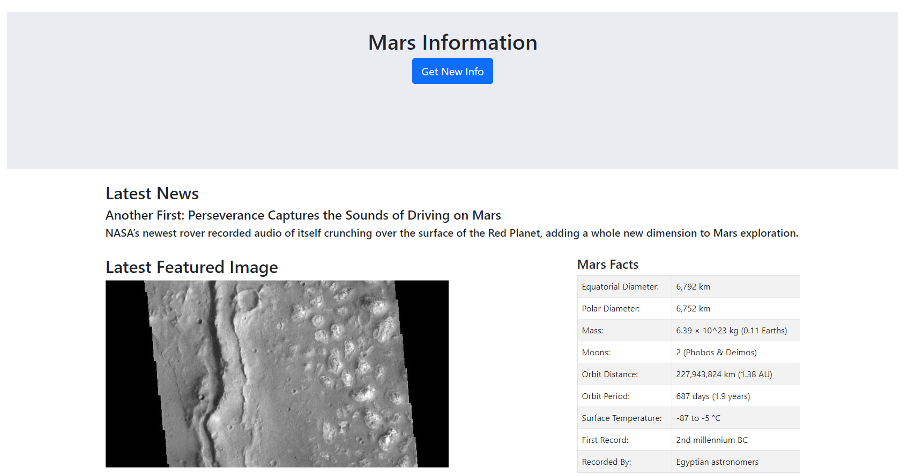
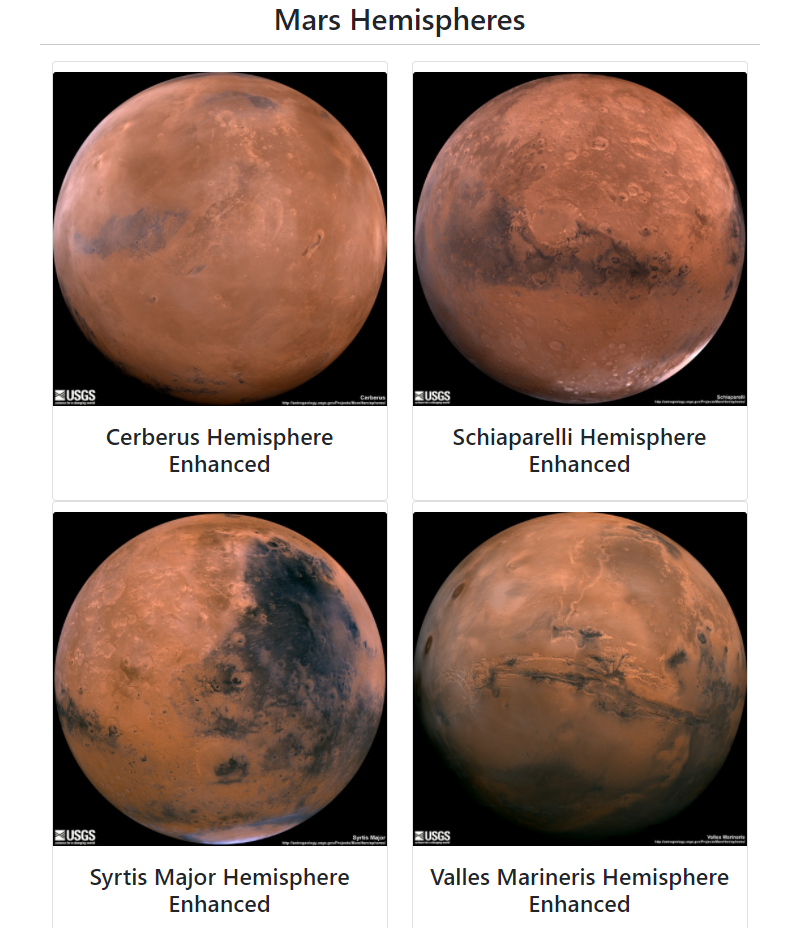

# Web Scraping

## Overview

Using Jupyter Notebook, BeautifulSoup, Pandas, and Requests/Splinter, various websites containing information on Mars were scraped.

Using Jupyter Notebook, the [NASA Mars News Site](https://mars.nasa.gov/news/) was scraped to collect the latest News Title and Paragraph Text featured on the site.
The full-sized JPL Featured Space Image found [here](https://data-class-jpl-space.s3.amazonaws.com/JPL_Space/index.html) was scraped.
A Mars facts table was scraped from [here](https://space-facts.com/mars/) and cleaned up with Pandas.
The titles of Mars hemispheres, as well as their full-sized images, found [here](https://astrogeology.usgs.gov/search/results?q=hemisphere+enhanced&k1=target&v1=Mars), were also scraped. For loops were utilized for efficiency, and each title was combined with their respective image and placed in a dictionary.

The original scraping done in Jupyter Notebook was then converted to a python script called scrape_mars.py. Then, an app.py was created to set up Flask routes, one to run the scraping in scrape_mars, and one to redirect the scraped information to localhost. All scraped information was stored in a Mongo database.

An HTML template was created to display the scraped information on localhost in the desired manner.

## Data

Obtained through the scraper and stored in MongoDB.

## Tools and Languages

* Database Management: MongoDB
* Data Cleaning: Jupyter Notebook, Pandas
* Back-End: Python Flask, BeautifulSoup, Requests/Splinter
* Front-End: HTML/CSS
